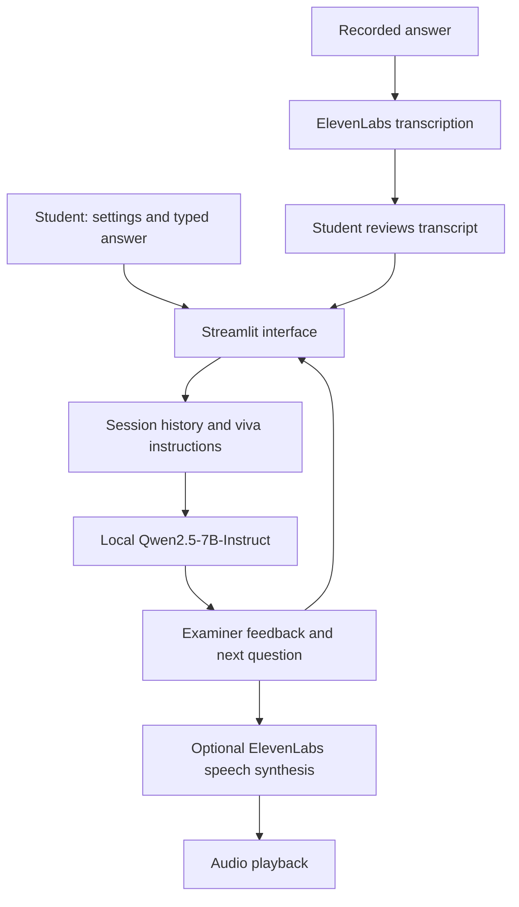

# 🎓 VivaSensei

### Your personal AI viva examiner

**A Streamlit app that turns viva preparation into a conversation: one question, your answer, concise feedback, and a follow-up.**

Built for students preparing for oral examinations, VivaSensei combines a locally running Qwen language model with optional ElevenLabs speech to help students practise explaining what they know.

**Hackathon focus:** Education · Conversational AI · Voice interaction

**Status:** Working local prototype

---

## The problem

Knowing a topic and explaining it under questioning are different skills. Notes and question banks help students revise, but offer limited practice with follow-up questions. A mock viva usually depends on another person being available to listen, assess an answer, and keep the discussion going.

## Our solution

VivaSensei gives students an on-demand practice examiner. Choose a subject, topic, difficulty, and areas you want to improve. The examiner asks a question, uses the conversation to respond to your answer, and continues with a follow-up.

Students can type or record an answer, review the transcript before submitting it, and listen to examiner responses. The default session covers **CMOS Analog IC Design → Current Mirrors**, but the subject and topic are editable.

## What the prototype does

| Feature | Student experience |
| --- | --- |
| Configurable practice | Set your subject, current topic, and Easy, Medium, or Hard difficulty. |
| Focus on weak areas | Enter weaknesses in the sidebar to guide the examiner's questions. |
| Conversational examination | The examiner is prompted to ask one question at a time, give brief feedback, and ask a follow-up. |
| Same-session memory | Earlier questions and answers stay in the context sent to the model. |
| Voice answers | Record speech, transcribe it through ElevenLabs, then review and edit before sending. |
| Spoken questions and feedback | Use **Listen** on a reply or enable **Read new replies aloud**. |
| Recoverable conversations | Retry, edit, or discard an unanswered message if generation fails. |
| Local language model | Qwen inference runs on the host machine; text chat needs no hosted LLM API key. |

## Why this approach

- **Practise explaining, not just recalling.** The question–answer–follow-up loop encourages students to articulate their understanding.
- **Bring context into the viva.** Topic, difficulty, self-reported weaknesses, and earlier turns guide the examiner.
- **Make oral practice accessible.** Typed and spoken answers share the same conversation, with an explicit transcript review step.
- **Run the examiner locally.** The CUDA path uses 4-bit quantization to reduce GPU memory requirements.

## Demo walkthrough

1. Launch the app and select **CMOS Analog IC Design**, **Current Mirrors**, and **Medium** difficulty.
2. Add **Channel length modulation** and **Output resistance** as weaknesses, then click **Apply settings**.
3. Click **Ask first question** and submit a typed answer. Show the examiner's feedback and follow-up.
4. Expand **Answer by voice**, record an answer, and click **Transcribe recording**. Review the text and click **Send voice answer**.
5. Click **Listen** beneath an examiner response to hear it aloud.
6. Change the topic and apply settings to continue the conversation, or click **Start new viva** to begin fresh.

The voice steps require an ElevenLabs API key and access to the configured models and voice. Text practice works without speech credentials.

## How it works



Settings and conversation history live in Streamlit session state. Each model call receives the viva instructions, current settings, and complete chat history. The model and tokenizer are cached across reruns, while conversations remain separate for each session. A lock serializes inference calls to the shared model.

## Tech stack

| Layer | Technology |
| --- | --- |
| Interface | Python, Streamlit |
| Language model | Qwen/Qwen2.5-7B-Instruct |
| Inference | PyTorch, Hugging Face Transformers, Accelerate |
| GPU quantization | bitsandbytes, 4-bit NF4 with double quantization |
| Voice | ElevenLabs Python SDK for transcription and speech synthesis |
| Configuration | python-dotenv |
| Validation | unittest, mocks, Streamlit AppTest, optional integration smoke checks |

## Run locally

### 1. Install dependencies

Run these commands from the **VivaSensei project directory**. Python 3.11 is the version used in the development environment.

```bash
python3 -m venv .venv
source .venv/bin/activate
python -m pip install -r requirements.txt
```

**Hardware and download requirements:**

- CUDA inference defaults to 4-bit weights. The development setup used an NVIDIA RTX 4050 with 6 GB VRAM for short sessions; available memory and workload affect whether a session fits.
- CPU inference uses bfloat16, and the script requires at least **16 GiB of available RAM**. Full bfloat16 GPU inference requires at least **16 GiB of available VRAM** and bfloat16 support.
- The first full inference downloads roughly **15 GB of model weights**, including when using 4-bit loading. Assets are cached under `.cache/huggingface/` unless `HF_HOME` is already set.

### 2. Validate model formatting

```bash
python inference.py --check
```

This downloads tokenizer/config assets and validates the chat template without loading model weights or generating a response.

### 3. Launch the app

```bash
python -m streamlit run app.py --server.address 127.0.0.1 --browser.gatherUsageStats false
```

Open the local URL printed by Streamlit. The model loads when the first response is requested. Use a terminal with GPU access for CUDA inference.

Once the model assets are cached, you can disable Hugging Face network requests:

```bash
HF_HUB_OFFLINE=1 python -m streamlit run app.py --server.address 127.0.0.1 --browser.gatherUsageStats false
```

This applies to model loading; optional ElevenLabs speech still requires a network connection.

### 4. Enable voice features (optional)

Create a `.env` file in the project directory:

```dotenv
ELEVENLABS_API_KEY=your_elevenlabs_api_key
```

The speech helper loads configuration relative to its own directory. Existing environment variables take precedence, followed by `.env.local`, then `.env`. Both environment files are gitignored.

The current helper defaults to `scribe_v2` for transcription, `eleven_v4` for speech synthesis, and voice ID `kLhAstPcnnPxqzk6gS5i`. Your account must support these settings; the defaults are defined in `speech_utils.py`.

Recordings are sent to ElevenLabs for transcription, and examiner text is sent for speech synthesis when those controls are used. Automatic speech is off by default. Speech failures preserve the text conversation.

### Optional: try the examiner from the terminal

```bash
python inference.py "Ask me one viva question about Miller's theorem."
python inference.py --device cuda --precision 4bit
python inference.py --device cpu
```

These device and precision flags configure the CLI. The Streamlit app uses automatic runtime selection.

## Project structure

```text
VivaSensei/
├── app.py              # Streamlit chat, settings, voice controls, and recovery
├── viva.py             # Viva settings and examiner instructions
├── inference.py        # Local Qwen loading, runtime selection, and generation
├── speech_utils.py     # ElevenLabs transcription and speech synthesis
├── database.py         # MongoDB session helpers; not connected to the app yet
├── requirements.txt    # Pinned application dependencies
└── tests/              # Automated tests and optional integration smoke checks
```

## Validation

Run the automated suite without loading Qwen weights or spending ElevenLabs credits:

```bash
python -m unittest discover -s tests -v
```

The suite covers session memory and isolation, settings changes, failed-response recovery, transcript review, audio caching, speech errors, runtime selection, and input limits.

Optional integration checks:

```bash
# Real model generation and conversation formatting; requires cached weights.
HF_HUB_OFFLINE=1 python tests/smoke_chat.py

# Real synthesis and transcription; requires credentials and uses API credits.
python tests/smoke_speech.py
```

The speech check saves its MP3 to `.cache/speech/smoke.mp3`. These checks validate integration behavior, not the factual accuracy of examiner feedback.

## Current limitations

- **Feedback accuracy:** The model can give incorrect technical explanations. Use it for practice and check explanations against course material.
- **Session persistence:** Chat history is temporary and can reset after a browser reload or server restart. `database.py` contains MongoDB helpers, but the app does not call them and `pymongo` is not in the current requirements.
- **Conversation length:** Input is capped at 2,048 tokens per call, with up to 192 new output tokens. If the complete history exceeds the limit, the app retains it and asks you to shorten the current answer or start a new viva.
- **Weakness tracking:** Weaknesses are entered by the student. Automatic scoring, weakness extraction, and progress analytics are not implemented.
- **Voice availability:** Speech depends on ElevenLabs connectivity, credits, and access to the configured models and voice. Browsers may require manual playback.

## What's next

- Connect persistent session storage and let students revisit past vivas.
- Add rubric-based assessment and progress summaries.
- Explore course-material grounding to improve the reliability of technical feedback.
- Support longer sessions with explicit conversation summarization.
- Make speech voice and model selection configurable in the interface.
